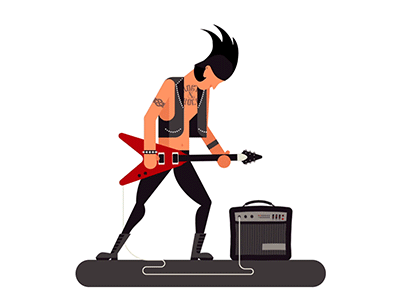

# band XD
> site for music band.


A Site in rails for a music bands.



## Installation

Windows & Linux:

```sh
git clone or download the project
```
## Technologies used

*  Ruby on Rails
*  Bulma front end Framework
*  Font awesome

## Development setup

Just run theses commands: 

```sh
bundle install
rails db:create
rails db:migrate
rails s
```
## Meta

Nelcifran Magalhaes – [@Linkedin](https://www.linkedin.com/in/nelcifranpires/
) – nelcifranpires@gmail.com

